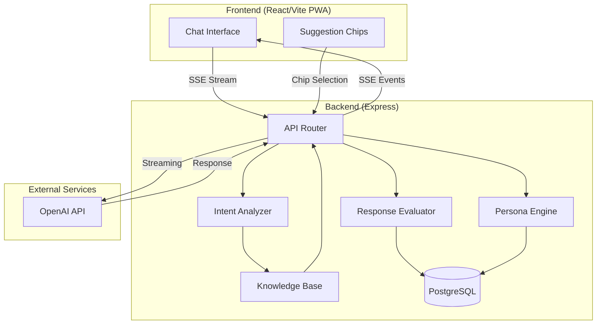
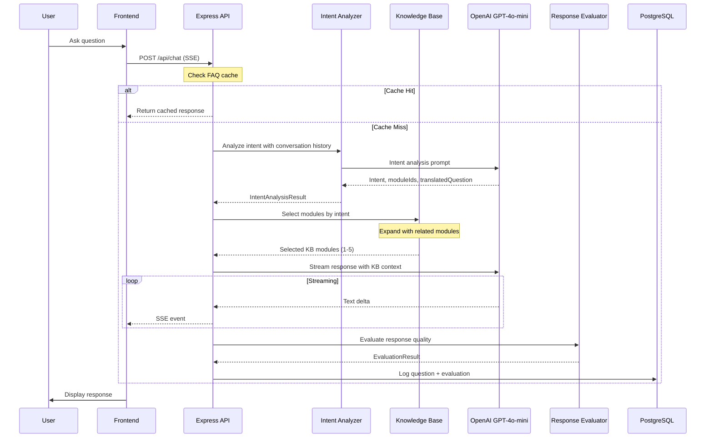
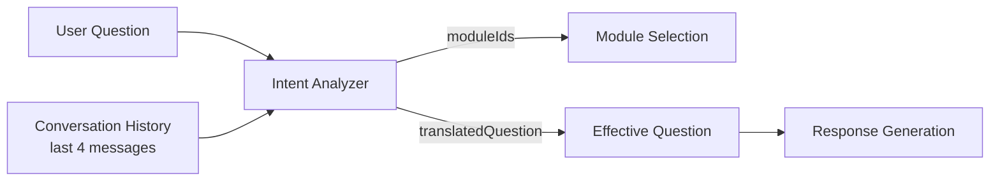
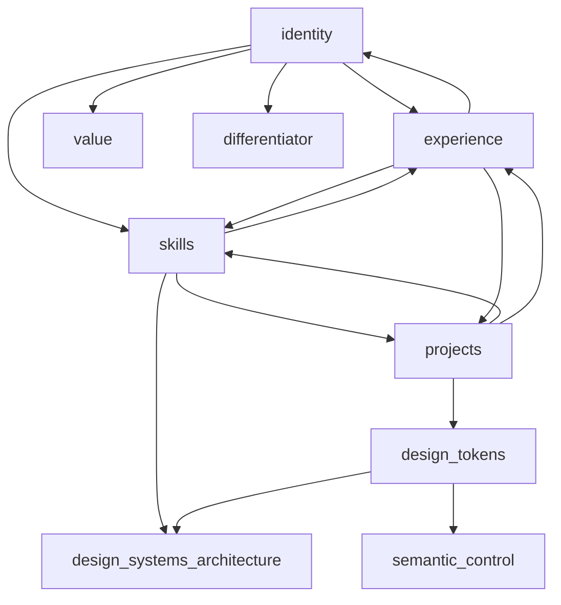
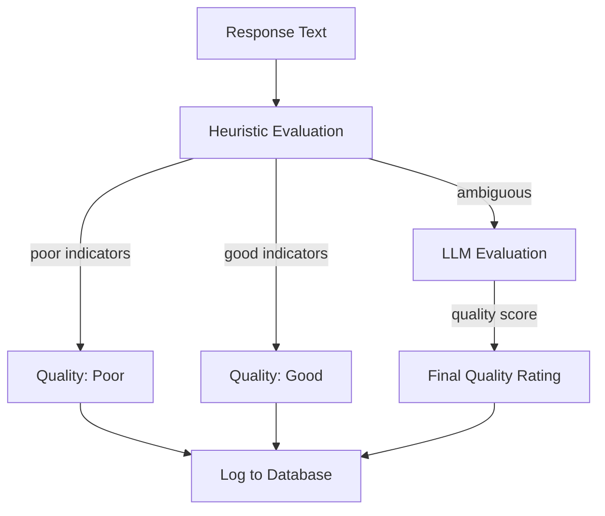
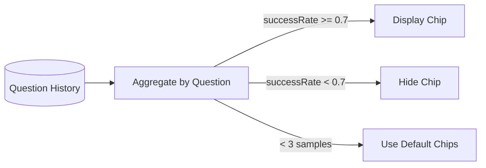

# ADR-001: ask.coty RAG Architecture

## Context

### Problem Statement

Building a Q&A agent about a specific person (Coty Beasley) presents unique challenges:

1. **Hallucination Prevention** - LLMs naturally generate plausible-sounding but fabricated information. For a personal Q&A agent, accuracy is paramount.
2. **Ambiguous Queries** - Users ask vague follow-up questions ("tell me more", "what else?") that require conversation context to interpret.
3. **Knowledge Coverage Gaps** - Not all questions can be answered well. The system should gracefully handle gaps and avoid surfacing questions it can't answer.
4. **Persona Adaptation** - Different users (recruiters, friends, peers) need different response styles without explicit mode-switching.

### Goals

- Only answer questions from a curated, grounded knowledge base
- Maximize response quality by intelligently matching questions to relevant knowledge
- Automatically evaluate response quality and use feedback to improve suggestions
- Adapt tone discretely based on inferred user persona
- Provide transparency into knowledge gaps for continuous improvement

### Design Philosophy

**Carrot First** - No gates, no "before we begin" prompts. Users interact immediately.

**Discrete Adaptation** - Persona inference happens silently. No visible mode switches or "you're in X mode" messaging.

**Quality Over Availability** - Better to not suggest a question than to suggest one that gets a poor response.

**Grounded Responses** - The LLM is constrained to synthesize answers from provided context only.

---

## Decision

### Architecture Overview



### RAG Request Flow



---

## Key Architectural Decisions

### 1. Intent Analysis with Conversation Context

**Decision:** Use an LLM-based intent analyzer that receives recent conversation history to interpret ambiguous questions.

**Rationale:** Follow-up questions like "tell me more" or "what about projects?" are meaningless without context. By passing the last 4 messages to the intent analyzer, it can infer the actual topic of interest.

**Implementation:**



The intent analyzer returns:
- `intent` - Brief description of user's goal
- `moduleIds` - 2-4 relevant knowledge module IDs
- `confidence` - high/medium/low
- `translatedQuestion` - Clearer reformulation of vague queries

**Trade-offs:**
- (+) Handles follow-up questions naturally
- (+) No explicit "context" UI needed
- (-) Additional LLM call per request (~50ms latency)
- (-) Translation quality depends on conversation history accuracy

### 2. Question Translation

**Decision:** When the intent analyzer detects an ambiguous question, it generates a `translatedQuestion` that is sent to the response LLM instead of the original.

**Rationale:** Vague questions like "and?" or "what else?" need to be transformed into specific queries the KB can answer.

**Example:**
```
Original: "What else?"
Context: [Previous discussion about design tokens]
Translated: "What additional details are there about Coty's design token work?"
```

**Implementation:**
- Intent analyzer generates translation as part of its JSON response
- `effectiveQuestion` = translatedQuestion ?? originalQuestion
- Response LLM receives effectiveQuestion
- Original question preserved for logging/caching

### 3. Module Relationship Expansion

**Decision:** When modules are selected, automatically include related modules up to a maximum of 5.

**Rationale:** Questions often span multiple knowledge areas. Asking about "skills" likely also benefits from "experience" and "projects" context.



**Implementation:**
```typescript
const MODULE_RELATIONSHIPS: Record<string, string[]> = {
  identity: ["experience", "skills", "value", "differentiator"],
  skills: ["experience", "projects", "design_systems_architecture"],
  // ... etc
};

function expandModulesWithRelated(moduleIds: string[], maxTotal = 5): string[] {
  const expanded = new Set(moduleIds);
  for (const moduleId of moduleIds) {
    const related = MODULE_RELATIONSHIPS[moduleId] || [];
    for (const relatedId of related.slice(0, 2)) {
      if (expanded.size < maxTotal) expanded.add(relatedId);
    }
  }
  return Array.from(expanded);
}
```

**Trade-offs:**
- (+) Richer context for comprehensive answers
- (+) Reduces "I don't have information" responses
- (-) Larger prompt = higher token cost
- (-) Risk of irrelevant context diluting focus

### 4. Response Quality Evaluation

**Decision:** Automatically evaluate every response using a tiered approach: fast heuristics first, LLM evaluation for ambiguous cases.

**Rationale:** Quality tracking enables the quality-gated suggestion system and identifies knowledge gaps for KB improvement.



**Heuristic Patterns:**

| Quality | Indicators |
|---------|------------|
| Poor | "I don't have information", "I'm not sure", "unable to", "unfortunately" |
| Partial | "while I can", "however", "limited information", "generally speaking" |
| Good | Specific references to Coty, projects, metrics, substantial length (>200 chars) |

**Implementation:**
- Heuristics run on every response (0ms overhead)
- LLM evaluation only when heuristics return "partial" (cost control)
- Results stored: `responseQuality`, `hasKnowledgeGap`, `evaluatedAt`

### 5. Quality-Gated Suggestions

**Decision:** Only display suggestion chips for questions that have historically received "good" quality responses.

**Rationale:** Suggesting questions the system can't answer well creates a poor user experience and erodes trust.



**Implementation:**
- Track success rate per suggestion chip text
- Minimum 3 responses before making quality judgment
- Threshold: 70% "good" responses required to remain active
- Fallback to default chips when insufficient data

### 6. Persona Adaptation

**Decision:** Silently infer user persona from behavioral signals and adapt response tone accordingly.

**Rationale:** A recruiter wants metrics and accomplishments; a friend wants stories and warmth. The system should adapt without asking.

```mermaid
stateDiagram-v2
    [*] --> default
    
    default --> evaluator: Technical/hiring signals
    default --> explorer: Casual/personal signals  
    default --> peer: Architecture/implementation signals
    
    evaluator --> evaluator: More hiring signals
    explorer --> explorer: More casual signals
    peer --> peer: More technical signals
    
    evaluator --> default: Low confidence decay
    explorer --> default: Low confidence decay
    peer --> default: Low confidence decay
```

**Persona Definitions:**

| Persona | Signals | Response Style |
|---------|---------|----------------|
| `evaluator` | "hire", "resume", "experience", "qualified" | Professional, metrics-focused, accomplishment-driven |
| `explorer` | "interesting", "story", "who is", casual language | Warm, conversational, story-driven |
| `peer` | "architecture", "stack", "implementation", "tradeoff" | Technical, collaborative, methodology-focused |
| `default` | No strong signals | Balanced, professional but approachable |

**Signal Sources (by reliability):**
1. Suggestion chip tap (highest signal)
2. First question keywords
3. Accumulated conversation trajectory

---

## Technical Reference

### Key Files

| File | Purpose |
|------|---------|
| `server/routes.ts` | API endpoints, SSE streaming, request orchestration |
| `server/intent-analyzer.ts` | Question interpretation, module selection, translation |
| `server/kb/modules.ts` | Knowledge base content and module definitions |
| `server/response-evaluator.ts` | Heuristic and LLM-based quality evaluation |
| `server/persona-engine.ts` | Persona detection and prompt adaptation |
| `server/storage.ts` | Database interface for analytics and questions |
| `shared/schema.ts` | TypeScript types and Drizzle schemas |
| `client/src/pages/chat.tsx` | Chat UI with streaming message rendering |

### API Endpoints

| Endpoint | Method | Description |
|----------|--------|-------------|
| `/api/chat` | POST | Streaming chat (SSE) - main Q&A endpoint |
| `/api/suggestions` | GET | Get quality-filtered suggestion chips |
| `/api/health` | GET | Health check |
| `/api/meta` | GET | App metadata |
| `/api/knowledge-gaps` | GET | Questions with unresolved knowledge gaps |
| `/api/evaluation/backfill` | POST | Evaluate historical responses in batch |

### Environment Variables

| Variable | Required | Description |
|----------|----------|-------------|
| `OPENAI_API_KEY` | Yes | OpenAI API key for GPT-4o-mini |
| `DATABASE_URL` | Yes | PostgreSQL connection string |

### Database Schema (Key Tables)

```sql
-- Question tracking and analytics
user_questions (
  id, question, response_text, response_quality,
  has_knowledge_gap, predicted_intent, metadata,
  session_id, persona_match, persona_confidence
)

-- Knowledge base modules
knowledge_modules (
  id, slug, name, content, keywords, is_active
)

-- Suggestion chips with quality tracking
suggestion_chips (
  id, text, signal_persona, signal_strength, is_active
)
```

---

## Consequences

### Positive

- **Grounded Responses**: LLM is constrained to KB context, dramatically reducing hallucination
- **Natural Follow-ups**: Conversation context enables intuitive multi-turn interactions
- **Self-Improving**: Quality tracking identifies gaps and filters poor suggestions
- **Discrete UX**: Persona adaptation happens invisibly, feels naturally personalized

### Negative

- **Latency Overhead**: Intent analysis adds ~50-100ms per request
- **Token Costs**: Broader module selection increases prompt size
- **Cold Start**: Quality-gating needs data before it's effective
- **Context Window**: Only 4 messages of history limits very long conversations

### Neutral

- **Evaluation Accuracy**: Heuristics are fast but imperfect; LLM evaluation more accurate but costly
- **Module Relationships**: Static relationship graph requires manual maintenance

---

## Status

**Accepted** - Implementation complete and in production.

### Future Considerations

1. **Semantic Search**: Replace keyword matching with embedding-based retrieval
2. **Feedback Loop**: Allow users to rate responses for evaluation calibration
3. **Dynamic Chips**: Generate suggestions based on conversation trajectory
4. **Multi-turn Memory**: Extend context window for longer sessions
